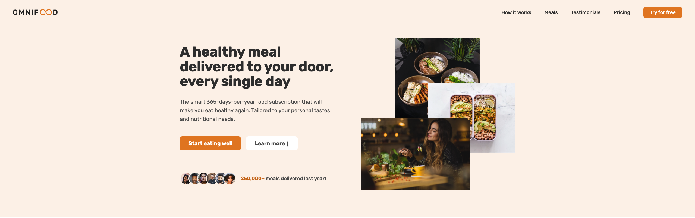
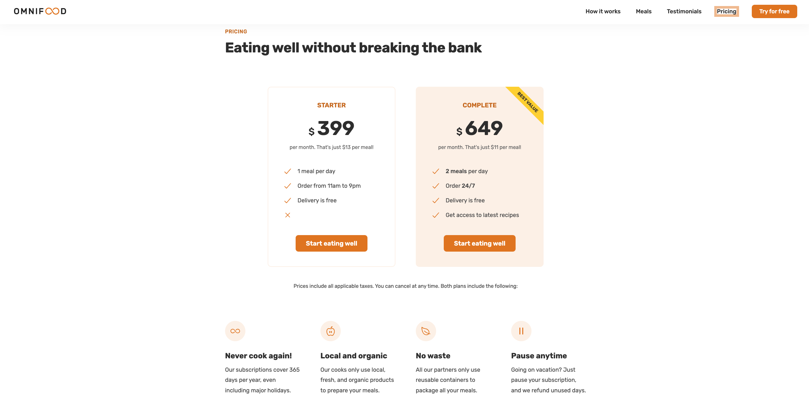

# Omnifood

<!-- Add license badge below -->

 

## Description

A technology company first, but with a major focus on consumer well-being through a healthy diet. Most people are very busy with their jobs, family and friends, and other important activities, which doesn't leave much time for cooking. This might lead to a poor diet and lasting health consequences. We want to solve this problem by using an AI-centric approach. Users can use the app to select their diet and foods they like and dislike, and the AI algorithm will create a custom and individual weekly meal plan. But it don't stop there. Partnered with restaurants and other cooking partners to actually cook and deliver all meals from the generated meal plans, in selected cities. All this will be packed up in a monthly subscription, where users can choose between receiving one or two meals per day, every single day of the month.

## Table of Contents

- [Link](#link)
- [ScreenShot](#screenshot)
- [Installation](#installation)
- [Usage](#usage)
- [Credits](#credits)
- [License](#license)
- [Badges](#badges)
- [API](#api)

## Link

Below are links to the deployed app and the repo: 
[Omnifood](https://omnifood-joshuagarcia.netlify.app/) 
[Projects_Repo](https://github.com/garciajv86/Omnifood)

## ScreenShot

## Installation

No installation needed!

## Usage

To use this app is relatively simple, just navigate to the website and in the navigation click on the section you would like to visit or just scroll to the section, if you want to use the form just fill out the form and click submit.

## Credits

- [Joshua V. Garcia](https://github.com/garciajv86)

- Jonas Schmedtman

## License

 
This project is protected under the [MIT](https://choosealicense.com/licenses/mit/) License.

## Badges

 

## API

The API's used are Google Fonts and ionicons.

- [Google Fonts](https://fonts.google.com/)
- [ionicons](https://ionic.io/ionicons/usage)
